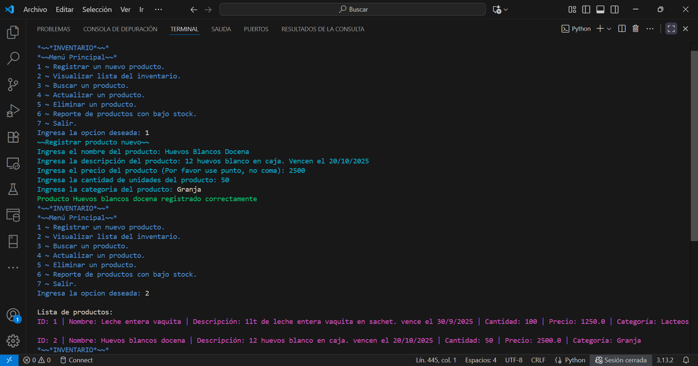

# 🛒 Sistema de Gestión de Inventario (CLI)

[](https://www.python.org/)
[](https://www.sqlite.org/)
[](https://opensource.org/licenses/MIT)
[](https://github.com/codespaces/new?hide_repo_select=true&ref=master&repo=mariawkpazcerpa-lang/inventario_productos)

Simulación de un sistema de inventario estilo supermercado optimizado para la línea de comandos (CLI). El proyecto implementa un **CRUD completo** con persistencia de datos relacional y una interfaz de usuario interactiva y estilizada en terminal.

Desarrollado como proyecto técnico para demostrar habilidades en estructuras de datos, manejo de base de datos local y lógica de negocio.

---

## 🛠️ Tecnologías y Librerías

*   **Lenguaje:** Python 3.10+
*   **Persistencia:** SQLite3 (Motor relacional embebido, sin dependencias de servidores externos).
*   **Interfaz CLI:** `Colorama` (Maquetación y resaltado de estados críticos mediante códigos ANSI).
*   **Core:** Módulos estándar `os`, `sys` y `typing`.

---

## ⚙️ Arquitectura y Funcionalidades

*   **CRUD Relacional:** Alta, Baja, Modificación y Lectura de productos con validación de tipos de datos en tiempo de ejecución.
*   **Persistencia Automatizada:** Creación y verificación de la estructura de tablas SQLite de forma transparente en el primer inicio.
*   **Módulo de Reportes:** Filtro inteligente para la detección automática de productos con bajo stock (Control de rotura de inventario).
*   **UX en Consola:** Formateo de datos en tablas limpias y alertas visuales por colores (Éxito, Error, Advertencia).

---

## 🚀 Cómo Ejecutar el Proyecto

### Opción A: En la Nube con GitHub Codespaces (Recomendado)
Para probar la aplicación de forma interactiva e inmediata sin instalar nada localmente:
1. Haz clic en el botón **Open in GitHub Codespaces** arriba (o crea uno manualmente desde la pestaña `Code` de este repositorio).
2. 2. Una vez que cargue el entorno, escribe en la terminal integrada:
```bash
   python main.py
### Opción B: Entorno Local
Requisitos previos: Tener Python 3 y Git instalados.

Cloná el repositorio:

Bash
   git clone [https://github.com/mariawkpazcerpa-lang/inventario_productos.git](https://github.com/mariawkpazcerpa-lang/inventario_productos.git)
   cd inventario_productos
Instalá las dependencias del proyecto: 
Bash
   pip install -r requirements.txt
Ejecutá el programa principal:

Bash
   python main.py
💻 Demostración de Flujo (CLI)
Plaintext
*~~*INVENTARIO*~~*
*~~Menú Principal~~*
1 ~ Registrar un nuevo producto.
2 ~ Visualizar lista del inventario.
3 ~ Buscar un producto.
4 ~ Actualizar un producto.
5 ~ Eliminar un producto.
6 ~ Reporte de productos con bajo stock.
7 ~ Salir.

Ingresa la opcion deseada: 1
>> [Formulario de Registro]
Ingresa el nombre del producto: Leche Entera Vaquita
Ingresa el precio del producto (Use punto para decimales): 1250.00
Ingresa la cantidad de unidades: 100

[✓] Producto 'Leche Entera Vaquita' registrado correctamente.
📷 Vista Previa de la Interfaz
💡 Tip de diseño para María: En lugar de la captura estática, si usas la herramienta ScreenToGif o Terminalizer y guardas un .gif interactivo de 10 segundos, arrástralo y suéltalo justo aquí abajo. Eso hace que el repositorio "cobre vida" en el portafolio.



📬 Contacto & Redes
Desarrolladora: María de la Paz Cerpa
Email: mariawkpazcerpa@gmail.com
LinkedIn: María de la Paz Cerpa
3. Una vez que cargue el entorno, escribe en la terminal integrada:
```bash
   python main.py
